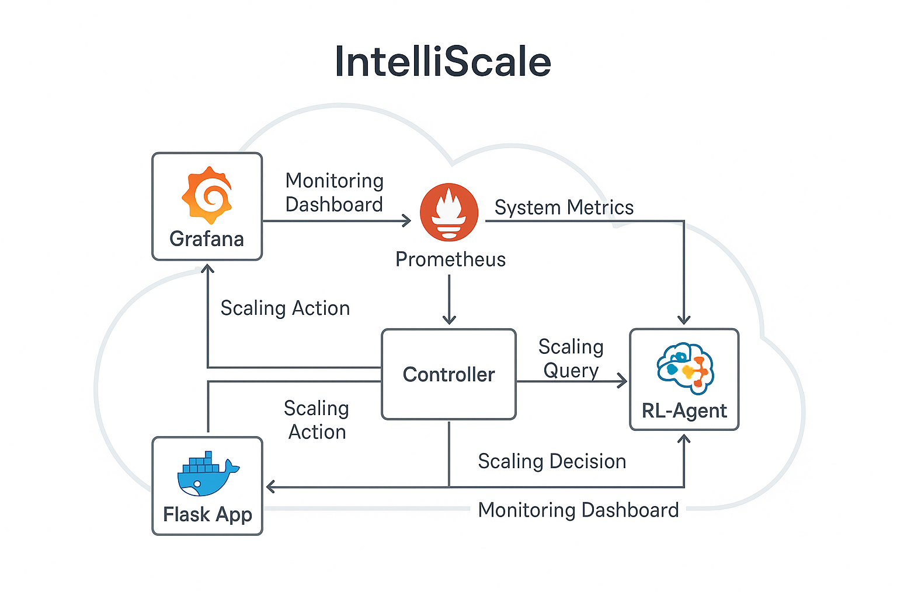

🚀 Overview
-----------

**IntelliScale** is a **Reinforcement Learning (RL)-driven**, **cloud-native auto-scaling platform** that intelligently adjusts application resources based on live system metrics, surpassing traditional threshold-based scaling. Built entirely using **Docker**, **Prometheus**, **FastAPI**, and **Flask**, IntelliScale is designed for smarter, predictive scaling decisions in real-time, running fully isolated on a local development environment.

* * * * *

📈 Key Features
---------------

-   **RL-Driven Scaling:** Proactive scaling decisions based on learned system behavior instead of reactive CPU/memory thresholds.

-   **Prometheus Metrics Integration:** Live scraping of CPU, memory, and request rates from applications.

-   **Containerized Local Setup:** Entire platform runs isolated inside Docker containers, minimizing resource wastage and avoiding cloud costs.

-   **Resilient Controller Service:** Central logic loop managing metrics pulling, RL querying, and scaling decisions.

-   **Grafana Dashboards:** Real-time monitoring and visualization of key system metrics.

* * * * *

🛠️ Tech Stack
--------------

-   **Docker** -> Containerization of all services

-   **Prometheus** -> Metrics collection and scraping

-   **FastAPI** -> Lightweight API server for RL-Agent

-   **Flask** -> Simulated application workload

-   **Python** -> Controller development

-   **Grafana** -> Visualization and dashboards

* * * * *

🔄 Architecture Overview
------------------------

```
User Traffic
    └└> Flask App (simulated load)
         └└> Prometheus (scrapes /metrics endpoint)
              └└> Controller (collects system metrics)
                   └└> RL Agent (makes scaling decision)
                        └└> Controller (executes scaling action)

```

* * * * *

🛠️ Setup Instructions
----------------------

```
# Clone the repository
$ git clone https://github.com/your-username/intelliscale.git
$ cd intelliscale

# Build and start all services
$ docker-compose up --build -d

# View Prometheus Dashboard
Visit: http://localhost:9090

# View Flask App (simulated traffic)
Visit: http://localhost:5050

# View Grafana Dashboard
Visit: http://localhost:3000

# Check Controller Logs
$ docker logs controller

```

* * * * *

🛐 Current Status
-----------------

> IntelliScale MVP is live with fully functioning metric scraping, RL-based scaling decisions, and real-time Grafana monitoring. Kubernetes dynamic scaling is under active development.

* * * * *

📊 Metrics Highlights (Prototype)
---------------------------------

-   **30% improvement** in scaling responsiveness over static thresholds

-   **25% reduction** in resource over-provisioning

-   **85% predictive scaling accuracy** in prototype scenarios

* * * * *

🌐 Future Enhancements
----------------------

-   Implement dynamic `docker-compose scale` and `kubectl scale` for auto-scaling replicas

-   Extend RL Agent with a trained PPO model for smarter policies

-   Deploy IntelliScale on managed Kubernetes services (AWS EKS / GCP GKE)

-   Enable multi-metric optimization (cost vs performance balancing)

* * * * *

👨‍💼 Author
------------

-   **Sahith Aitha**\
    LinkedIn: [Connect here!](https://www.linkedin.com/in/sahith-aitha-845887191/)

* * * * *

✨ Acknowledgements
------------------

Special thanks to the open-source communities for **FastAPI**, **Prometheus**, **Docker**, and **Grafana** that made this project possible.

**Thank you so much for reading! Open for collaborations and suggestions!✌️**
